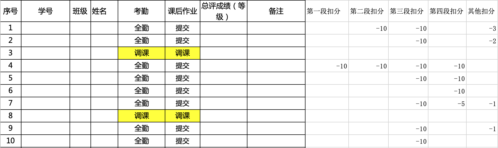
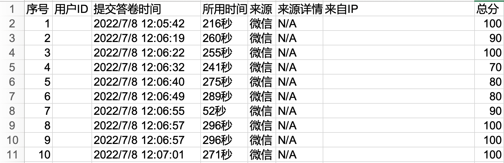

# TA_EMBA_Manual

## 1. 按照下方的评分标准进行手动评分

>【课后作业】
请结合自己的生活或者工作经历，设计一个具体的从数据到价值的实践方案。不需要做任何数据分析，但是需要给出整个方案的构思框架，以PDF文档形式提交。具体格式要求如下。

成绩打分采取扣分制，100分满分，60分为及格分，取**扣分和60的最低分**，确保交作业的人及格。

`第一段`：背景介绍，描述业务背景，介绍业务问题，提出业务痛点，说明不确定性现象。
- 给分点：具体详细的背景介绍，以及自然地引入对应的业务难题，给10分。
- 扣分点1：只有几句话，比较敷衍，扣10分。
- 扣分点2：背景介绍大体具备，但太过简略，扣5分。
- 扣分点3：缺少业务痛点，扣5分。

`第二段`：因变量：结合业务问题，确定因变量Y，并论述其重要性。
- 给分点：根据业务难题提出具体可量化的因变量Y并解释，给10分。
- 扣分点1：因变量不好量化，扣10分。
- 扣分点2：因变量可能收集不到足够的数据，扣5分。
- 扣分点3：没有解释重要性，扣5分。


`第三段`：解释性变量：结合业务问题，设计多个X指标，并论述其重要性。
给分点：围绕因变量Y提出具体可量化的自变量X并解释，给10分。
- 扣分点1：自变量不好量化或者太笼统没写可以量化的点，扣10分。
- 扣分点2：对自变量X没有解释，扣10分。
- 扣分点3：对自变量X解释太简略或者自变量的个数太少，扣5分。
- 扣分点4：有用的因变量太少，扣5分。


`第四段`：产品实践：假设该模型被成功开发完成，请问如何将该模型应用于实际工作。
给分点：根据模型可以得到什么（假象的）结论并应用在实际上，给10分。
扣分点1：应用没有结合模型结果，扣10分。
扣分点2：应用太笼统，与模型结合不紧密，扣5分。

`其他扣分点`：
- 扣分点1：用语不够书面，口语化，一处扣1分。
- 扣分点2：不规范的标点符号，一处扣1分。
- 扣分点3：空行不规范，一处扣1分。
- 扣分点4：某个地方出现不和谐的颜色或者突然加粗，一处扣1分。
- 扣分点6：使用PPT等其他报告格式或者文件格式提交，扣10分。
- 扣分点7：报告书整体格式不规范，扣2-5分。

🫥 打分后形成下面这张小分表（内含各项细分扣分，方便核验成绩）。


## 2. 合并作业成绩及平时测验成绩

老师那边会提供4个课堂测试的成绩，例如下面这张截图。需要将测试成绩也加入到最终成绩计算的过程中。



> 合并成绩单

``` R
library(readxl)
library(writexl)

path = "/Users/helenology/Desktop/研二上/emba成绩计算/"

grade = read_excel(paste0(path, '数据思维：从不确定性中发掘商业价值.xls'),
                   skip=3)

files_candidate = list.files(path)

for(i in 1:length(files_candidate)){
  # 如果是标题里含有课后测验
  if(grepl('课后测试', files_candidate[i])){
    test_path = paste0(path, files_candidate[i])
    test = read_excel(test_path)
    test = test[, c('用户ID', '总分')]
    names(test) = c('姓名', strsplit(files_candidate[i], '-')[[1]][1])
    grade = merge(grade, test, by='姓名', all.x=T) # 融合数据
    print("Adding a test")
    }
}

# 保存成绩单
grade = grade[order(as.numeric(grade$序号), decreasing = F), ]
grade = grade[!is.na(grade$姓名), ]

# 存储为excel表格
write_xlsx(
  grade,
  path = paste0(path, "tmp.xlsx"),
  col_names = TRUE,
  format_headers = TRUE,
  use_zip64 = FALSE
)
```

## 3. 计算最终成绩

在excel里【对测试成绩取平均】得到【测验平均分】，然后加权：【测试平均分】$\times$ 0.7 + 【作业分数】$\times$ 0.3
